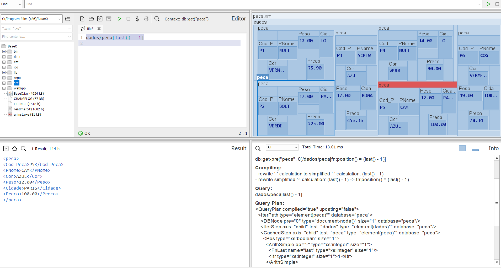
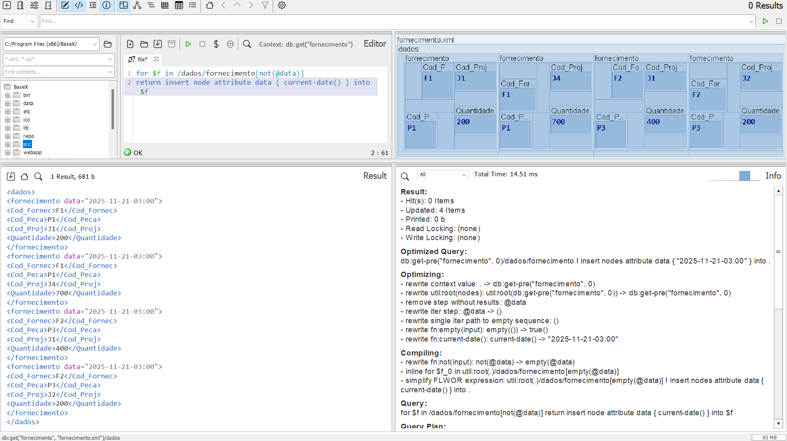
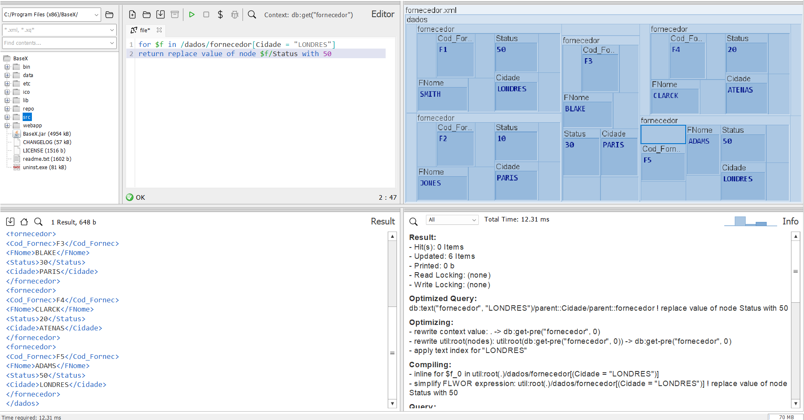
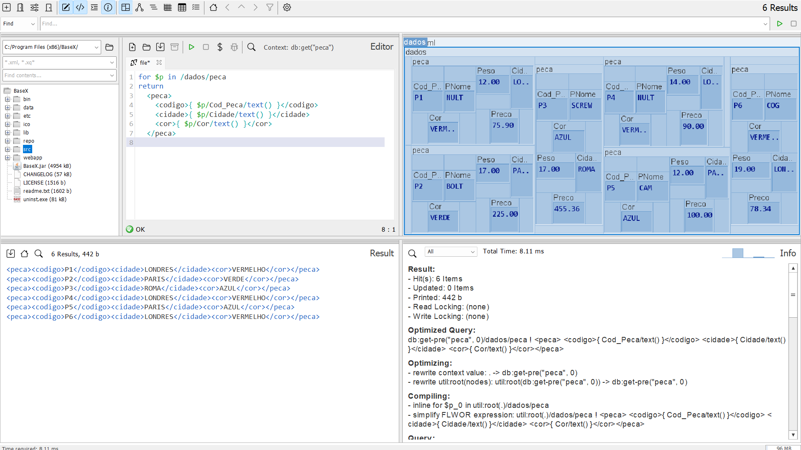
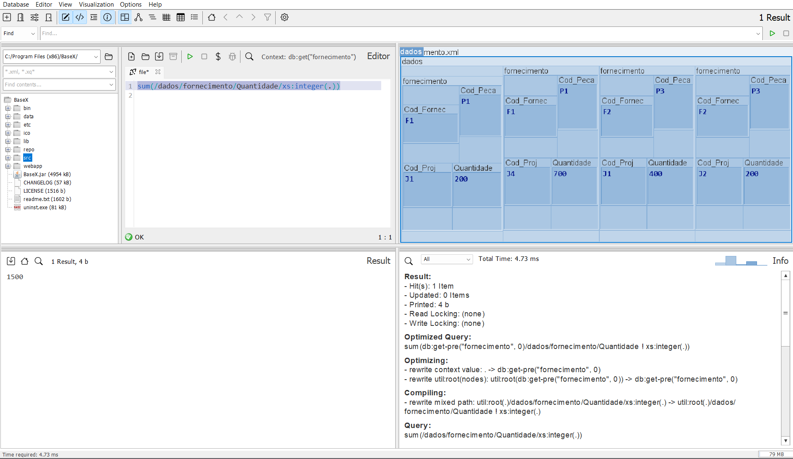
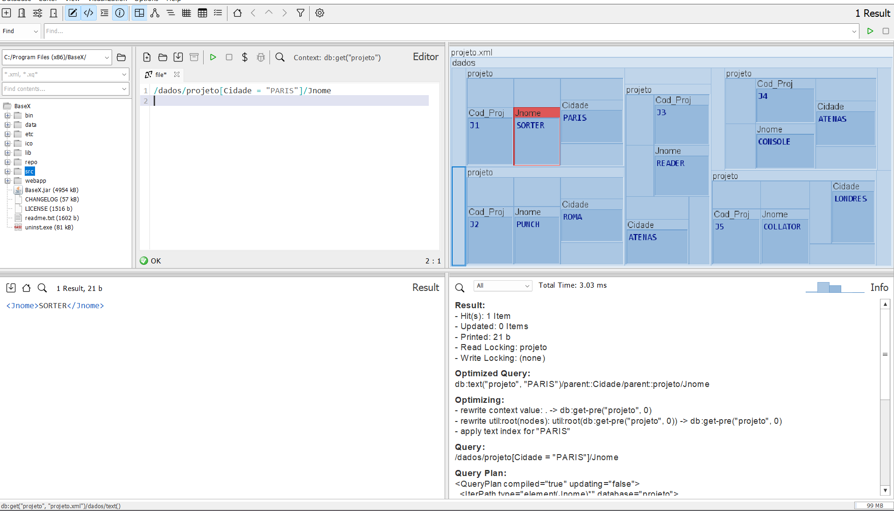
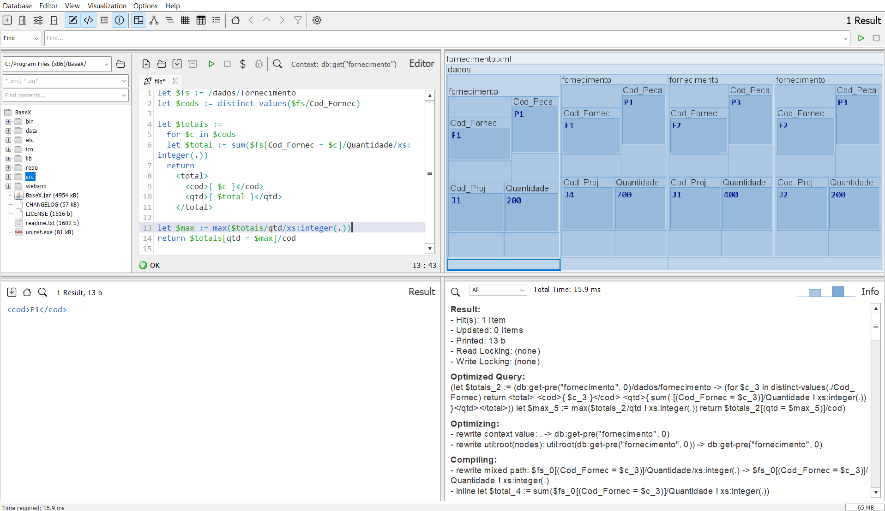
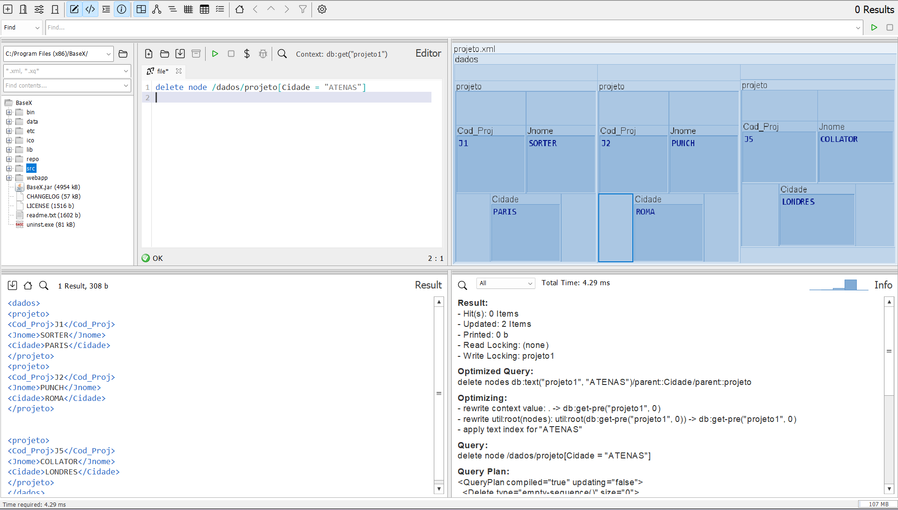
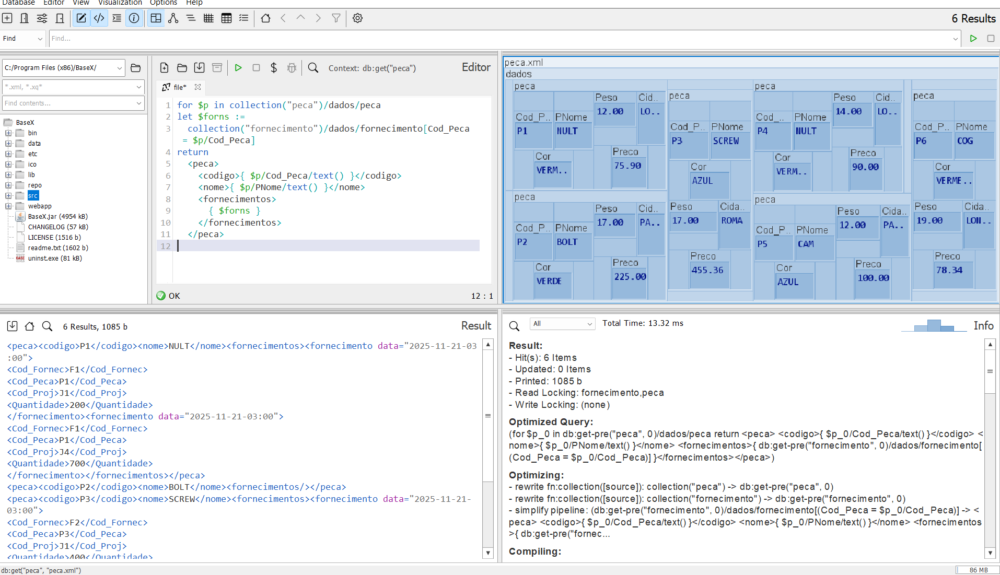
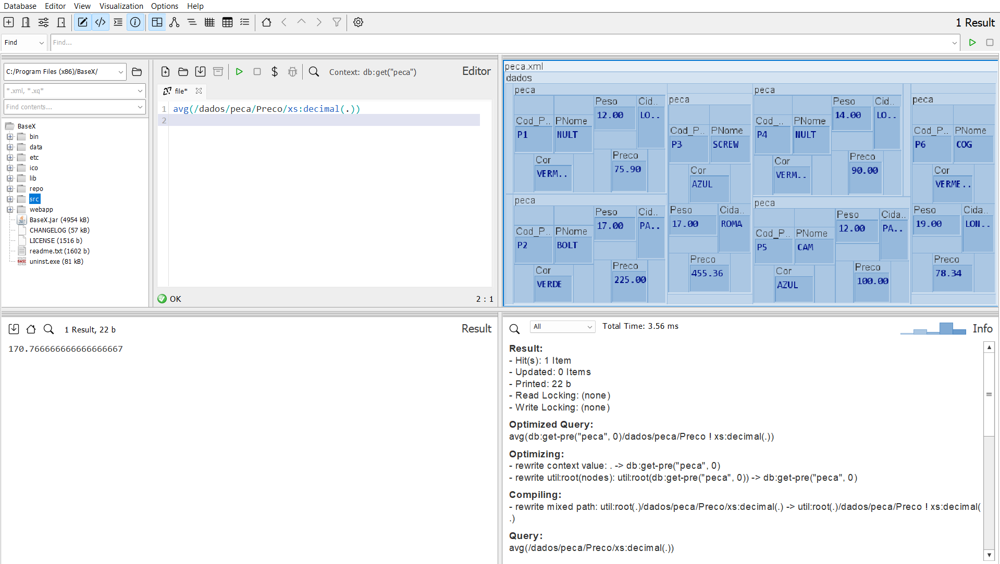

# Consultas XQuery

## (a) Retornar os dados da penúltima peça da árvore XML

Banco utilizado: peca
```
dados/peca[last() - 1]
```


## (b) Inserir atributo data (YYYY-MM-DD) em todos os fornecimentos

Banco utilizado: fornecimento
```
for $f in /dados/fornecimento[not(@data)]
return insert node attribute data { current-date() } into $f
```


## (c) Atualizar o status dos fornecedores de Londres para 50

Banco utilizado: fornecedor
```
for $f in /dados/fornecedor[Cidade = "LONDRES"]
return replace value of node $f/Status with 50
```


## (d) Retornar código, cidade e cor de todas as peças

Banco utilizado: peca
```
for $p in /dados/peca
return
  <peca>
    <codigo>{ $p/Cod_Peca/text() }</codigo>
    <cidade>{ $p/Cidade/text() }</cidade>
    <cor>{ $p/Cor/text() }</cor>
  </peca>
  ```


## (e) Obter o somatório das quantidades dos fornecimentos

Banco utilizado: fornecimento
```
sum(/dados/fornecimento/Quantidade/xs:integer(.))
```


## (f) Obter os nomes dos projetos de Paris

Banco utilizado: projeto
```
/dados/projeto[Cidade = "PARIS"]/Jnome
```


## (g) Obter o código dos fornecedores que forneceram peças em maior quantidade

Banco utilizado: fornecimento
```
let $fs := /dados/fornecimento
let $cods := distinct-values($fs/Cod_Fornec)

let $totais :=
  for $c in $cods
  let $total := sum($fs[Cod_Fornec = $c]/Quantidade/xs:integer(.))
  return
    <total>
      <cod>{ $c }</cod>
      <qtd>{ $total }</qtd>
    </total>

let $max := max($totais/qtd/xs:integer(.))
return $totais[qtd = $max]/cod
```


## (h) Excluir os projetos da cidade de Atenas

Banco utilizado: projeto
```
delete node /dados/projeto[Cidade = "ATENAS"]
```


## (i) Obter os nomes das peças e seus dados de fornecimento

Usa dois bancos: peca + fornecimento
```
import module namespace db="http://basex.org/modules/db";

for $p in db:open("peca")/dados/peca
let $forns :=
  db:open("fornecimento")/dados/fornecimento[Cod_Peca = $p/Cod_Peca]
return
  <peca>
    <codigo>{ $p/Cod_Peca/text() }</codigo>
    <nome>{ $p/PNome/text() }</nome>
    <fornecimentos>{ $forns }</fornecimentos>
  </peca>
```


## (j) Obter o preço médio das peças

Banco utilizado: peca
```
avg(/dados/peca/Preco/xs:decimal(.))
```

